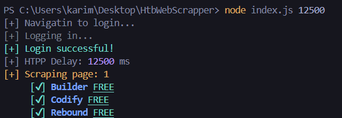
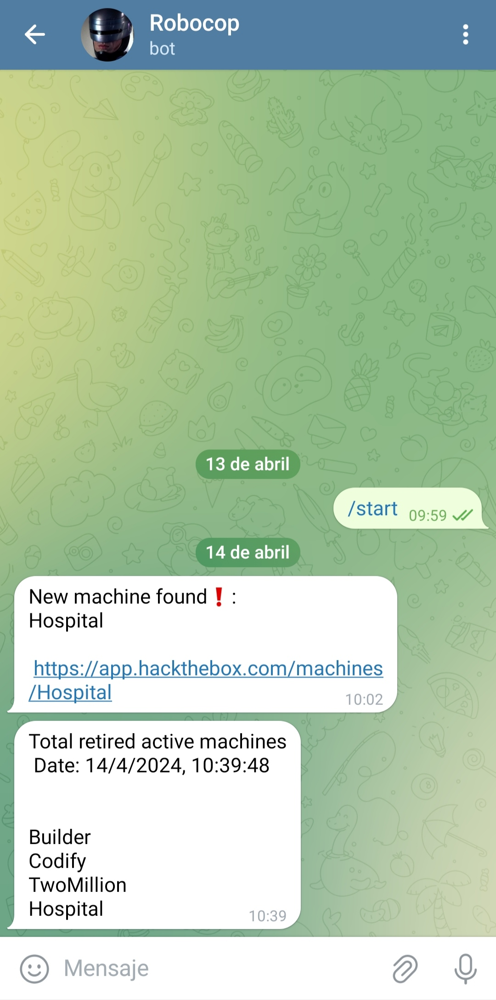

# HTB Retired Machines Web Scraper
## Description

This is a Node.js tool that uses Puppeteer to scrape the HTB website for retired machines that are free to play.

----
## How does it work?
- This tool logs in to the HTB page with your ****.env**** credentials, it goes page by page going through machines, if it finds a free one it adds it to the  *txt file*, it does the opposite with the ones it sees that are not free, if they were in the file because they were free before but no longer, delete them, the file will always have all the retired machines that at that moment are free from HTB.
If the tool finds a new machine that is not included in the *txt file*, can also send you a Telegram message.
## Notes

1. This script has a delay to make HTTP requests to the HTB website so that your IP does not get considered as part of a DoS attack.
2. The default delay is 10 seconds (10000 ms). You can specify a **longer*** delay:

```shell
node index.js (ms for delay)

node index.js 20000 
```
3. The script writes NEW machines to [./totalMachines.txt](./totalMachinesNames.txt). When it finds a new one not registered, it adds it to the file and sends you a Telegram message from your bot. 
4. For instructions on creating your bot, see: https://sendpulse.com/knowledge-base/chatbot/telegram/create-telegram-chatbot.

## Use
- `npm install`
- Create a .env file in the main directory.
- Add the following variables:
```shell
EMAIL=yourHTBemail@gmail.com
PASSWORD=yourHTBpassword
botToken=yourTelegramBotToken
chatId=yourTelegramBotChatId 
```
- If you do not want to use a Telegram bot, leave the last two fields blank.
- Automate the script execution on your platform (e.g., Linux Crontabs).
 

## Example


 


